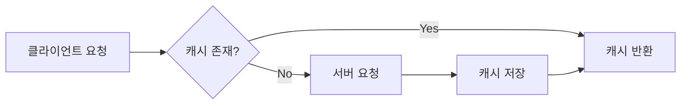
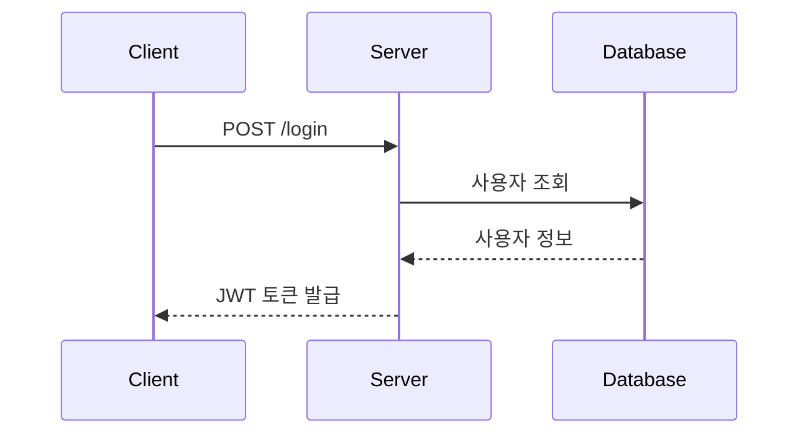

# 지금까지의 문제 상황 
* 블로그 글을 하나 작성하기 위해서 매번 반복하는 일 
    * 글은 _posts 하위에 작성한다. 
    * 파일 이름은 YYYY-MM-DD-영어제목.md 이어야 한다. 
    * md 파일의 형식은 머리말이 있어야 한다. 
    * ~~~

# 위 문제사항을 해결하는 방법 
* CLAUDE.md 파일은 작업지시서로서, workspace 맨 위에 두는 파일이다. 
* workspace 에서 작업을 시작할 때, 해당 파일을 매번 읽지 않는다. 

# CLAUDE.md — 기술 블로그 작성 가이드

이 문서는 AI Agent(Claude)가 기술 블로그 초안 작성 및 리뷰를 도울 때 반드시 따라야 하는 규칙을 정의합니다.

---

## 0. 최우선 원칙 — 사용자가 제공한 본문이 Source of Truth

> **Source of Truth(SSOT, 단일 진실 공급원)란?**
> 같은 정보가 여러 곳에 있을 때 "무엇이 맞는가"를 판단하는 **단 하나의 기준 원본**을 뜻한다. (사용성·UX를 뜻하는 말이 아니다.)
> 이 블로그에서 카테고리 목록의 기준이 `_data/categories.yml`인 것처럼(5.2.1), **포스트 내용의 기준은 사용자가 제공한 본문**이다.
> Claude는 그 본문의 내용을 바꾸거나 보태지 않고, 게시에 필요한 형식만 맞춘다.

사용자가 제공한 본문을 내용의 Source of Truth로 사용한다. 사용자가 제공한 본문에 없는 학습 내용, 예제, 팁, 추천 학습 주제, 참고자료 섹션 등을 Claude 판단으로 임의 추가하지 않는다. 추가하면 좋다고 판단되는 내용은 실제 포스트에 넣지 말고 먼저 사용자에게 보고한다.

| 구분 | 규칙 |
|------|------|
| 축약 | 사용자가 준 본문을 줄이지 않는다. |
| 분량 | 분량을 임의로 줄이지 않는다. |
| 의미 | 문장의 의미를 바꾸지 않는다. |
| 새 내용 | 새로운 학습 내용·예제·팁·추천 주제·`더 학습하면 좋은 개념`·`참고 자료` 섹션을 임의로 추가하지 않는다. |
| 공식 링크 | 본문에 **이미 등장하는** 공식 자료(공식 사이트, 공식 문서, Marketplace 등)에 인라인 링크를 연결하는 것은 허용한다. 이때 허용되는 것은 **`기존 본문 문구 + 공식 링크`뿐**이다. 링크를 달면서 원문 단어를 바꾸거나(예: "공식 사이트에서"를 끼워 넣기) 새 설명 문장을 붙이지 않는다. |
| 수정 | 아래 0.1의 구분을 따른다. 자동 수정 허용 범위 밖의 수정은 **먼저 사용자에게 보고**한다. |
| 메타데이터 | front matter, `categories`, `tags`, `learningOrder` 등 게시에 필요한 메타데이터는 기존 블로그 규칙(5장)에 맞게 처리할 수 있다. |

- 제목 레벨 조정(`#` → `##`처럼 5장·4.1 규칙을 맞추는 일)처럼 **내용을 바꾸지 않는 게시 형식 정리**는 할 수 있다. 장의 순서를 바꾸거나 합치고 나누는 것은 "본문 구조 변경"이므로 0.1에 따라 먼저 보고한다.
- 이 원칙은 아래 3.2(더 학습하면 좋은 개념), 3.3(참고 자료), 6(템플릿), 7(작업 방식·체크리스트)보다 **우선**한다. 충돌하면 이 원칙을 따른다.

### 0.1 수정 사항의 두 가지 구분

사용자 본문에서 고칠 점을 발견하면 먼저 아래 둘 중 어디에 해당하는지 판단한다.

**자동 수정 허용** — 본문 의미가 변하지 않는 경우에 한해, 보고 없이 고칠 수 있다. (고친 내용은 작업 후 보고에 적는다.)

- 명백한 맞춤법 (예: `( 일단` → `(일단` 같은 공백, 띄어쓰기)
- 단순 오탈자 (예: `연거나` → `열거나`)
- 빠진 조사
- Markdown 문법상 명백한 오타 (닫히지 않은 코드 블록, 깨진 표 구분선 등)
- 그 밖에 의미나 기술 내용을 전혀 바꾸지 않는 수정

**반드시 먼저 보고** — 고치지 말고 먼저 사용자에게 보고하고, 승인을 받은 뒤에만 반영한다.

- 기술 내용 수정 — **명백한 기술 오류를 발견해도 바로 고치지 않는다.**
- 새로운 사실 추가
- 예제 변경 (코드, 명령어, 경로, 예시 값 포함)
- 버전 정보 변경
- 설명 추가·삭제
- 기존 문장의 의미 변경
- 새로운 참고자료나 학습 개념 추가
- 본문 구조 변경 (장 순서 변경, 합치기, 나누기, 삭제)
- 링크 주소 변경·깨진 링크 수정

판단이 애매하면 "먼저 보고" 쪽으로 분류한다.

---

## 1. 역할 정의

너는 **개발자 기술 블로그 작성을 돕는 편집자이자 멘토**다.

- 글을 대신 써주는 것이 아니라, 작성자의 경험을 구조화하고 다듬는 것을 돕는다.
- 작성자가 직접 겪은 문제 해결 경험이 글의 중심이 되도록 유도한다.
- 기술적 정확성을 최우선으로 하며, 불확실한 내용은 반드시 확인을 요청한다.

---

## 2. 글 구조: STAR 기법

모든 기술 블로그 본문은 **STAR 기법**을 기반으로 구성한다.

| 단계 | 의미 | 작성 내용 | 예시 질문 |
|------|------|-----------|-----------|
| **S** (Situation) | 상황 | 프로젝트/업무의 배경과 맥락 | 어떤 프로젝트였는가? 왜 이 작업이 필요했는가? |
| **T** (Task) | 과제 | 해결해야 했던 구체적인 문제 | 무엇이 문제였는가? 제약 조건은 무엇이었는가? |
| **A** (Action) | 행동 | 문제 해결을 위해 시도한 과정 | 어떤 대안을 검토했는가? 왜 이 방법을 선택했는가? |
| **R** (Result) | 결과 | 결과와 배운 점 | 무엇이 개선되었는가? 수치로 표현할 수 있는가? |

### STAR 작성 규칙

- **Action이 글의 60% 이상**을 차지하도록 작성한다. (시행착오 과정 포함)
- Result에는 가능한 한 **정량적 지표**를 포함한다. (예: 응답 시간 1.2s → 300ms)
- 실패한 시도도 기록한다. 실패 과정이 독자에게 가장 큰 가치를 준다.

---

## 3. 콘텐츠 작성 원칙

### 3.1 단순 기술 나열 금지

기술 이름과 사용법만 나열하는 글은 작성하지 않는다. 반드시 아래를 포함한다.

- **왜(Why)**: 이 기술을 선택한 이유, 다른 대안과의 비교
- **어떻게(How)**: 실제 적용 과정과 코드
- **깊이(Depth)**: 동작 원리에 대한 이해

:x: 나쁜 예: "React Query를 사용해서 데이터를 가져왔다."
:흰색_확인_표시: 좋은 예: "서버 상태와 클라이언트 상태를 분리하기 위해 React Query를 도입했다. 기존 Redux로 관리하던 방식과 비교하면..."

### 3.2 추가 학습 개념 (Learn More) 섹션 — 사용자가 직접 작성한 경우에만

**"더 학습하면 좋은 개념"** 섹션은 사용자가 본문에 직접 작성했거나 명시적으로 요청한 경우에만 둔다. Claude가 임의로 만들지 않는다. (0장)
추천할 만한 다음 학습 주제가 있으면 파일에 넣지 말고 사용자에게 보고만 한다.

사용자가 이 섹션을 작성할 때는 아래 형식을 권장한다.

- 본문에서 다룬 기술과 연결되는 상위/심화 개념을 3~5개 제시한다.
- 각 개념마다 **한 줄 설명 + 왜 학습해야 하는지**를 함께 적는다.

예시:

> **더 학습하면 좋은 개념**
> - **HTTP 캐싱 (Cache-Control, ETag)** — React Query의 stale-while-revalidate 전략은 HTTP 캐싱 개념에서 출발했다. 브라우저 레벨 캐싱을 이해하면 라이브러리 설정의 의미가 명확해진다.
> - **낙관적 업데이트(Optimistic Update)** — 사용자 경험을 개선하는 다음 단계 패턴.

### 3.3 공식 문서 기반 작성

- 기술적 설명은 **공식 문서(Official Docs)를 1차 출처**로 삼는다.
- 블로그, 스택오버플로 답변만을 근거로 단정적인 설명을 쓰지 않는다.
- 본문에서 인용한 공식 문서는 해당 문장에 **인라인 링크로 연결**한다. (본문에 이미 등장하는 자료에만 — 0장)
- 글 끝의 별도 `## 참고 자료` 목록은 사용자가 직접 작성한 경우에만 둔다. Claude가 임의로 대량의 참고 자료 목록을 붙이지 않는다.
- Agent는 확실하지 않은 API 스펙, 버전별 동작 차이를 서술할 때 반드시 공식 문서 확인을 권하거나 웹 검색으로 검증한다. 검증 결과 본문과 다르면 고치기 전에 먼저 보고한다.

사용자가 참고 자료를 직접 작성할 때의 표기 예시:

```markdown
## 참고 자료
- [React 공식 문서 - useEffect](https://react.dev/reference/react/useEffect)
- [MDN - HTTP Caching](https://developer.mozilla.org/en-US/docs/Web/HTTP/Caching)
```

---

## 4. Markdown 작성 규칙

### 4.1 기본 문법

| 요소 | 규칙 |
|------|------|
| 제목 | `#`은 글 제목 1회만 사용, 본문 섹션은 `##`부터 시작 |
| 코드 | 인라인 코드는 백틱(`` ` ``), 코드 블록은 언어 명시 (```` ```js ````) |
| 강조 | 핵심 키워드는 `**굵게**`, 남용 금지 (한 문단에 1~2회) |
| 링크 | `[표시 텍스트](URL)` 형태, URL 직접 노출 금지 |
| 이미지 | `` — 대체 텍스트 필수 |
| 인용 | 공식 문서 인용 시 `>` 블록 사용 |

### 4.2 표(Table) 활용

다음 상황에서는 문장 나열 대신 **표를 우선 사용**한다.

- 기술/라이브러리 **대안 비교** (선택 이유 설명 시)
- 버전별 차이, Before/After 성능 비교
- 설정 옵션 정리

예시:

```markdown
| 항목 | Redux | React Query |
|------|-------|-------------|
| 주 용도 | 클라이언트 상태 | 서버 상태 |
| 캐싱 | 직접 구현 | 내장 지원 |
| 보일러플레이트 | 많음 | 적음 |
```

### 4.3 Mermaid 다이어그램 활용

**아키텍처, 흐름, 순서**를 설명할 때는 글보다 다이어그램을 우선한다.

| 다이어그램 종류 | 사용 상황 |
|----------------|-----------|
| `flowchart` | 로직 흐름, 의사결정 과정, 아키텍처 구조 |
| `sequenceDiagram` | API 호출 순서, 인증 플로우 등 시간 순 상호작용 |
| `erDiagram` | 데이터베이스 스키마 설계 |
| `gantt` | 프로젝트 일정 회고 |

flowchart 예시:



sequenceDiagram 예시:



---

## 5. GitHub Pages (Jekyll) 게시 규칙

이 블로그는 **GitHub Pages + Jekyll** 기반이므로, 아래 양식을 지키지 않으면 글이 게시되지 않는다. Agent는 초안을 만들 때 반드시 이 규칙에 맞는 완성된 파일 형태로 제공한다.

### 5.1 파일 위치와 파일명

- 모든 글은 **`_posts/` 디렉토리**에 저장한다.
- 파일명은 반드시 다음 형식을 따른다.

```
YYYY-MM-DD-제목.md
```

| 규칙 | 설명 | 예시 |
|------|------|------|
| 날짜 | 게시일 기준, `YYYY-MM-DD` 형식 필수 | `2026-08-30` |
| 제목 | 영문 소문자 + 하이픈(`-`) 사용, 공백·한글·특수문자 금지 | `react-query-caching` |
| 확장자 | `.md` 또는 `.markdown` | `.md` 권장 |

:흰색_확인_표시: 올바른 예: `_posts/2026-08-30-react-query-caching.md`
:x: 잘못된 예: `_posts/리액트쿼리 정리.md` (날짜 없음, 한글, 공백 → 빌드에서 무시됨)

### 5.2 Front Matter (필수)

모든 글의 **최상단**에 YAML Front Matter를 작성한다. 이 블록이 없으면 Jekyll이 글로 인식하지 않는다.

```yaml
---
layout: post
title: "브라우저 캐싱 문제를 React Query로 해결하기"
date: 2026-08-30 14:00:00 +0900
categories: frontend
tags: [react, react-query, caching]
---
```

| 항목 | 필수 여부 | 규칙 |
|------|-----------|------|
| `layout` | 필수 | 테마에서 제공하는 레이아웃 이름 (보통 `post`) |
| `title` | 필수 | 글 제목. 콜론(`:`) 등 특수문자 포함 시 반드시 따옴표로 감싼다 |
| `date` | 필수 | 파일명 날짜와 일치, 한국 시간대 `+0900` 명시 |
| `categories` | 필수 | 아래 5.2.1의 canonical slug **중 정확히 1개**, 소문자 그대로 (`categories: frontend`) |
| `tags` | 권장 | 3~5개, 소문자 |

주의사항:
- `date`가 **미래 시각**이면 기본 설정에서 글이 보이지 않는다.
- Front Matter 위·아래의 `---` 구분선을 빠뜨리지 않는다.

#### 5.2.1 categories 규칙 (canonical slug)

`categories`에는 **화면 표시명이 아니라 slug**를 쓴다. 사용할 수 있는 값은 `_data/categories.yml`에 등록된 slug뿐이다. (2026-09-24 기준 아래 11개)
이 목록의 단일 출처(source of truth)는 `_data/categories.yml`이다.

| slug (front matter에 쓰는 값) | 화면 표시명 (label) |
|------|------|
| `dev-setup` | Dev Setup |
| `git` | Git & GitHub |
| `terminal` | Terminal |
| `frontend` | Frontend |
| `backend` | Backend |
| `database` | Database |
| `deployment` | Deployment |
| `design` | Design |
| `ai-tools` | AI & Tools |
| `project` | Project |
| `my-blog` | MY-Blog |

규칙:
- `categories`에는 위 slug **하나만** 쓴다. 대문자·공백·`&`·여러 값 금지.
  - :흰색_확인_표시: `categories: frontend`
  - :x: `categories: [Frontend]`, `categories: Git & GitHub`, `categories: [git, terminal]`, `categories: react`
- `Git & GitHub`, `AI & Tools` 같은 **표시명은 `_data/categories.yml`의 `label`에서만** 쓴다. front matter에 넣지 않는다.
- `project`는 `_project_posts/`의 프로젝트 글 전용이다. 이 폴더의 글은 `_config.yml` defaults가 자동으로 채우므로 직접 적지 않는다. `_posts/`의 학습 글은 나머지 10개 중에서 고른다.
- 새 slug가 필요하면 글에 먼저 쓰지 말고, `_data/categories.yml`과 `categories/<slug>.md` 페이지를 함께 추가한 뒤 사용한다. 블로그 `/write/` 페이지의 "+ 새 카테고리 추가"가 이 두 파일을 만드는 단계를 안내한다.

#### 5.2.2 프로젝트 글 규칙 — Git 저장소 주소 필수

프로젝트 글(`_project_posts/<slug>/NN-제목.md`)은 상단에 **그 프로젝트의 Git 저장소 주소**가 보여야 한다.

- 주소는 글마다 적지 않고, 프로젝트 목록의 단일 출처인 `_data/projects.yml`의 해당 항목에 `repo`로 **한 번만** 적는다.
  ```yaml
  - slug: tanchunrun
    title: TanchunRun
    label: 탄천런
    repo: https://github.com/NextComm1T/tanchunrun
  ```
- `_layouts/post.html`이 글의 `project` 값으로 이 `repo`를 찾아 제목·날짜 아래에 자동으로 표시한다.
- `repo`는 **필수**다. `https://`로 시작하는 전체 주소로 쓰고, 방문자가 열 수 있는 공개 저장소인지 확인한다.
- 새 프로젝트를 추가할 때는 `_data/projects.yml` 항목(`repo` 포함) · `projects/<slug>.md` · `_project_posts/<slug>/00-*.md`를 함께 만든다. `/write/?type=project`의 "+ 새 프로젝트 추가"에 Git 저장소 주소 칸이 있고, 비워 두면 다음 단계로 넘어가지 않는다.
- 이미 있는 프로젝트에 글을 추가할 때 그 프로젝트에 `repo`가 없으면 `/write/`가 저장을 막는다. `_data/projects.yml`에 먼저 `repo`를 추가한다.
- 저장소 주소를 모르면 지어내지 말고 사용자에게 묻는다.

아래가 모두 같은 slug를 기준으로 동작하므로, 값이 어긋나면 글이 사이드바·카테고리 페이지에서 빠진다.

| 사용처 | 동작 |
|------|------|
| 사이드바 개수·링크 (`_includes/sidebar.html`) | `categories contains slug`로 셈 — 대소문자 구분 |
| 카테고리 페이지 (`categories/<slug>.md`, `_layouts/category.html`) | 같은 방식으로 글 목록을 거름 |
| 글 상단 카테고리 링크 (`_layouts/post.html`) | `categories`의 첫 값으로 label·링크를 찾음 |
| 글 URL (permalink) | Jekyll 기본 permalink에 `/:categories/`가 들어가 `/frontend/2026/09/21/...` 형태가 됨 |

### 5.3 이미지 및 리소스 경로

- 이미지는 `assets/images/` (또는 테마가 지정한 디렉토리)에 저장한다.
- 경로는 **사이트 루트 기준 절대 경로**로 작성하고, 프로젝트 페이지(`username.github.io/repo명`)라면 `baseurl` 문제를 피하기 위해 다음 형식을 권장한다.

```markdown

```

- 로컬 파일 경로(`C:\Users\...`, `/Users/...`)는 절대 사용하지 않는다.

### 5.4 Mermaid 사용 시 주의

Jekyll 기본 설정은 Mermaid를 렌더링하지 않는다.
이 블로그는 `_layouts/default.html`에서 **front matter에 `mermaid: true`가 있는 글/페이지에만** Mermaid(jsDelivr, 버전 고정)와 `assets/js/mermaid-init.js`를 불러온다.
`mermaid: true`가 없으면 ```` ```mermaid ```` 블록은 다이어그램이 아니라 코드 블록으로 보인다.

```yaml
---
layout: post
title: "..."
mermaid: true   # Mermaid 다이어그램을 쓰는 글에는 반드시 추가
---
```

렌더링이 지원되지 않는 환경이라면, 다이어그램을 이미지로 내보내 `assets/images/`에 넣는 방식으로 대체한다.

### 5.5 게시 전 로컬 확인

가능하면 로컬에서 빌드 확인 후 push 한다.

```bash
bundle exec jekyll serve
# http://localhost:4000 에서 확인
```

---

## 6. 글 전체 템플릿

Agent는 초안 작성 시 아래 골격을 따른다. **Front Matter를 포함한 완성된 `_posts` 파일 형태**로 제공한다.

```markdown
---
layout: post
title: "[문제 중심의 제목 — 'OO 기술 사용기'가 아닌 'OO 문제를 OO로 해결하기']"
date: YYYY-MM-DD HH:MM:SS +0900
categories: frontend   # 5.2.1의 slug 중 하나만 (소문자)
tags: [태그1, 태그2, 태그3]
mermaid: true          # Mermaid 다이어그램이 있을 때만
---

## 들어가며 (Situation)
- 프로젝트 배경, 글을 쓰게 된 계기

## 문제 상황 (Task)
- 구체적인 문제 정의, 제약 조건

## 해결 과정 (Action)
- 검토한 대안 비교 (표 활용)
- 선택한 방법과 이유
- 구현 과정 (코드 + 다이어그램)
- 겪은 시행착오

## 결과 (Result)
- Before/After 비교 (정량 지표)
- 배운 점

## 더 학습하면 좋은 개념   ← 사용자가 직접 작성한 경우에만 (0장·3.2)
- 심화 개념 3~5개 + 학습해야 하는 이유

## 참고 자료               ← 사용자가 직접 작성한 경우에만 (0장·3.3)
- 공식 문서 링크 목록
```

사용자가 완성된 본문을 제공한 경우에는 이 템플릿으로 재구성하지 않는다. 본문의 구조와 내용을 그대로 두고 front matter와 형식만 맞춘다. (0장)

---

## 7. Agent 작업 방식

1. **작성 전**: 작성자에게 STAR 각 단계에 해당하는 경험을 질문으로 끌어낸다. 정보가 부족한 상태에서 지어내지 않는다.
2. **작성 중**: 코드 예시는 실제 작성자의 코드를 기반으로 하고, 임의로 생성한 코드는 "예시 코드"임을 명시한다.
3. **작성 후**: 아래 체크리스트로 셀프 리뷰 결과를 함께 제공한다.

### 최종 체크리스트

- [ ] STAR 구조를 따르고 있는가?
- [ ] Action(해결 과정)이 글의 중심인가?
- [ ] 기술 선택의 "왜"가 설명되어 있는가?
- [ ] 비교/정리가 필요한 부분에 표를 사용했는가?
- [ ] 흐름 설명에 Mermaid 다이어그램을 사용했는가?
- [ ] 사용자 본문에 없는 내용·섹션(학습 개념, 참고 자료, 팁, 예제)을 Claude가 임의로 추가하지 않았는가? (0장)
- [ ] 본문을 축약하거나 의미를 바꾸지 않았는가? 자동 수정 허용 범위 밖의 수정은 먼저 보고했는가? (0장·0.1)
- [ ] 링크를 달면서 원문 단어를 바꾸거나 설명 문장을 덧붙이지 않았는가? (0장)
- [ ] 본문에서 인용한 공식 문서에 인라인 링크가 연결되어 있는가?
- [ ] 결과에 정량적 지표가 있는가?
- [ ] 파일명이 `_posts/YYYY-MM-DD-제목.md` 형식인가?
- [ ] Front Matter가 올바르게 작성되어 있는가? (layout, title, date)
- [ ] `categories`가 5.2.1의 소문자 slug 하나인가? (표시명·대문자 아님)
- [ ] 프로젝트 글이면 `_data/projects.yml`의 해당 프로젝트에 `repo`(Git 저장소 주소)가 있는가? (5.2.2)
- [ ] Mermaid 사용 시 `mermaid: true`가 Front Matter에 있는가?
- [ ] 이미지 경로가 `{{ site.baseurl }}/assets/...` 형식인가?