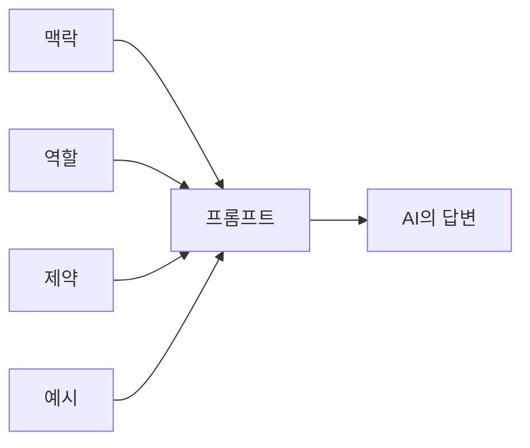
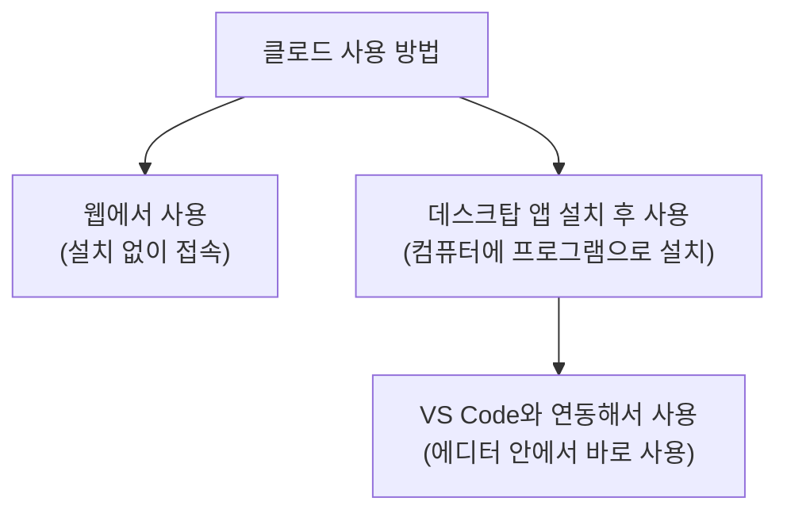

오늘은 블로그 두 번째 글이에요. 이번엔 명령어 대신, AI(클로드)를 더 잘 쓰는 방법에 대해 공부한 걸 정리해볼게요.

## 1. 오늘 공부한 것 한눈에 보기

## 2. 좋은 프롬프트 작성하는 법

AI에게 그냥 "이거 해줘"라고만 하면 원하는 답이 잘 안 나올 때가 많아요. 프롬프트를 몇 가지 요소로 나눠서 써주면 훨씬 원하는 결과에 가까운 답을 받을 수 있다는 걸 배웠어요.

|구성 요소 | 언제 쓰나|
|---|---|
|맥락 (Context)| AI가 상황을 이해할 배경 정보를 알려주고 싶을 때|
|역할 (Role)| AI가 어떤 입장/전문가로서 답해줬으면 할 때|
|제약 (Constraint)| 꼭 지켜야 할 조건이나 하지 말아야 할 것을 정할 때|
|예시 (Example)| 원하는 형식이나 톤을 미리 보여주고 싶을 때|

**선생님 팁**: 실제로 오늘 이 글을 요청할 때도 맥락 → 역할 → 제약 → 예시 순서로 써서 클로드에게 요청했어요. 이렇게 요소를 나눠서 정리하면 AI도 헷갈리지 않고, 나도 내가 뭘 원하는지 더 명확하게 정리할 수 있어요.

## 3. 클로드 사용 환경 비교

이번 주에는 클로드를 웹에서만 쓰다가, 데스크탑 앱을 직접 설치해보고 VS Code와 연결해서도 써봤어요.

|사용 환경 | 특징|
|---|---|
|웹 (브라우저)| 설치 없이 브라우저로 바로 접속해서 사용|
|데스크탑 앱| 내 컴퓨터에 프로그램으로 설치해서 사용|
|데스크탑 설치 후 VS Code 연동| 코드 에디터 안에서 바로 클로드를 사용|

## 4. 직접 해본 것: 예전 포스트 다시 작성해보기

배운 걸 확인해보려고, 저번에 웹에서 썼던 포스트를 이번엔 데스크탑에 설치한 클로드로 다시 작성해봤어요. 같은 내용이라도 어떤 환경에서 쓰는지에 따라 작업하는 느낌이 다르다는 걸 직접 경험해볼 수 있었어요.

## 정리하며

오늘은 명령어가 아니라 "AI를 어떻게 더 잘 쓸까"에 대해 공부했어요. 프롬프트를 맥락·역할·제약·예시로 나눠서 쓰는 법을 배웠고, 클로드를 웹/데스크탑/VS Code 연동으로 각각 써보면서 차이를 직접 확인해봤어요. 다음에는 또 어떤 걸 배우게 될지 기대되네요!
