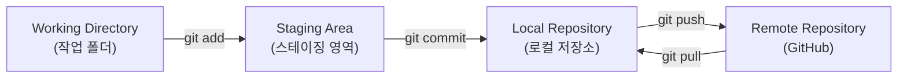
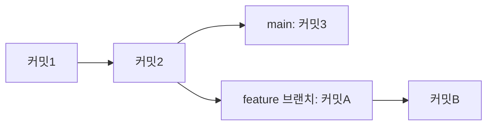

Git 기초부터 브랜치까지, 버전 관리의 큰 그림 잡기
## 들어가며 (Situation)

지금까지 `git add`, `git commit`, `git push` 같은 명령어는 하나씩 따로 배웠지만, 이게 전체적으로 어떤 그림 안에서 움직이는 건지 정리한 적은 없었다. 특히 브랜치(branch)는 명령어는 써봤어도 "왜 나누는지", "언제 합치는지"에 대한 개념이 명확하지 않았다. 그래서 오늘은 Git의 기초 개념과 시작 방법, 기본 명령어, 브랜치 용어와 과정을 한 번에 묶어서 정리해보기로 했다.

## 문제 상황 (Task)

정리하면서 명확히 하고 싶었던 것은 세 가지였다.

- Git이 정확히 무엇을 관리해주는 도구인지 (버전 관리의 개념)
- 저장소를 시작하고, 파일을 저장하기까지의 기본 명령어 흐름
- 브랜치라는 개념이 왜 필요하고, 실제로 어떤 용어와 과정으로 이루어지는지

## 해결 과정 (Action)

### 1. Git은 무엇을 하는 도구인가

Git은 **버전 관리 시스템(version control system, 파일이 바뀐 기록을 저장하고 되돌릴 수 있게 해주는 도구)**이다. 파일을 수정할 때마다 커밋(commit, "여기까지 저장!"하고 남기는 스냅샷)을 남겨서, 나중에 과거 시점과 비교하거나 되돌아갈 수 있다.

### 2. 시작하기

| 명령어 | 하는 일 |
|---|---|
| `git init` | 지금 폴더를 새 Git 저장소로 만든다 (처음 1번만) |
| `git clone <URL>` | 원격 저장소(GitHub 등)를 통째로 복사해온다 |

### 3. 기본 명령어 흐름

파일이 저장되기까지 4단계를 거친다는 걸 그림으로 정리하니 훨씬 이해가 잘 됐다.



| 명령어 | 하는 일 |
|---|---|
| `git status` | 지금 뭐가 바뀌었는지, 뭐가 저장 대기 중인지 확인 |
| `git add 파일명` | 파일을 스테이징 영역(커밋 전 담아두는 장바구니)에 담기 |
| `git commit -m "메시지"` | 담아둔 것을 하나의 스냅샷으로 저장 |
| `git log` | 지금까지 저장된 커밋 목록 보기 |
| `git push` | 로컬 저장소의 기록을 원격 저장소에 올리기 |
| `git pull` | 원격 저장소의 새 기록을 내 컴퓨터로 받아오기 |

### 4. 브랜치 개념과 과정

브랜치(branch)는 커밋이 이어지는 타임라인에서 갈라져 나온 또 다른 줄기다. 원본(main)을 건드리지 않고 따로 실험하거나 새 기능을 만들 때 쓴다.



| 용어 | 쉬운 설명 |
|---|---|
| main (또는 master) | 기본이 되는 대표 브랜치, 보통 완성된 코드가 있는 곳 |
| checkout / switch | 작업할 브랜치를 바꿔서 그쪽으로 옮겨가는 것 |
| merge (병합) | 다른 브랜치의 변경 내용을 원래 브랜치에 합치는 것 |
| conflict (충돌) | 같은 부분을 서로 다르게 고쳐서 Git이 어느 걸 써야 할지 못 정하는 상황 |
| HEAD | 지금 내가 보고 있는 위치(커밋)를 가리키는 포인터 |

실제 작업 과정은 이렇다.

```bash
# 1. 새 브랜치 만들고 그쪽으로 이동
git branch feature-post
git checkout feature-post
# (또는 한 번에) git checkout -b feature-post

# 2. 그 브랜치에서 작업하고 커밋
git add .
git commit -m "새 글 초안 작성"

# 3. main으로 돌아와서 병합
git checkout main
git merge feature-post
```

### 헷갈렸던 점

처음에는 `git branch`와 `git checkout`이 왜 따로 나뉘어 있는지 헷갈렸다. `branch`는 갈래를 "만들기만" 하고, `checkout`은 그 갈래로 "이동"하는 것이라는 걸 구분하고 나서야 `checkout -b`가 왜 둘을 합친 단축 명령인지 이해가 됐다.

## 결과 (Result)

명령어를 개별로 외우던 상태에서, "작업 폴더 → 스테이징 → 로컬 저장소 → 원격 저장소"라는 하나의 흐름과 "브랜치는 그 흐름이 갈라졌다가 다시 합쳐지는 것"이라는 큰 그림으로 이해할 수 있게 됐다. 브랜치를 왜 나누는지도 명확해졌다.

- **안전함**: main은 항상 정상 작동 상태로 유지, 실험은 별도 브랜치에서
- **협업**: 여러 사람이 각자 브랜치에서 동시 작업 가능
- **되돌리기 쉬움**: 실패한 시도는 브랜치째로 버리면 끝

## 더 학습하면 좋은 개념

- **rebase** — 브랜치 기록을 병합 전에 정리하는 또 다른 방법이다. merge와 결과물이 다르게 남기 때문에 언제 어떤 걸 써야 하는지 비교해볼 필요가 있다.
- **pull request (PR)** — GitHub에서 "이 브랜치를 main에 합쳐도 될까요?"라고 리뷰를 요청하는 절차다. 실제 협업에서 merge 전 필수 단계라 꼭 익혀야 한다.
- **.gitignore** — 커밋에 포함시키지 않을 파일을 지정하는 설정 파일이다. 저장소를 깔끔하게 유지하는 데 필요하다.
- **git diff** — 수정 전후 내용을 자세히 비교해주는 명령어다. `add`하기 전에 뭐가 바뀌었는지 확인하는 습관을 들이는 데 도움이 된다.

## 참고 자료
- [Git 공식 문서 - Git Basics](https://git-scm.com/book/en/v2/Git-Basics-Getting-a-Git-Repository)
- [Git 공식 문서 - Branches in a Nutshell](https://git-scm.com/book/en/v2/Git-Branching-Branches-in-a-Nutshell)
- [GitHub 공식 문서 - About branches](https://docs.github.com/en/pull-requests/collaborating-with-pull-requests/proposing-changes-to-your-work-with-pull-requests/about-branches)
