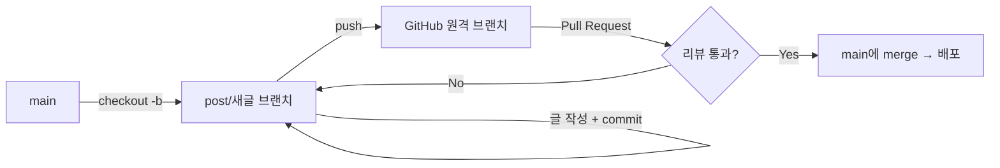

## 들어가며 (Situation)

이 블로그 저장소를 보면 `one`, `two`, `nav`처럼 브랜치를 나눠서 글을 쓰고 PR로 main에 합쳐온 기록이 있다. 그런데 정작 "왜 브랜치를 나눠서 글을 쓰는지", "합칠 때 무슨 일이 생길 수 있는지"는 명확히 정리한 적이 없어서 오늘 이 부분을 짚어보기로 했다.

## 문제 상황 (Task)

- 블로그 글을 `main`에서 바로 쓰지 않고 브랜치로 나눠 쓰는 이유가 뭔지
- 브랜치를 합칠(merge) 때 생기는 충돌(conflict)이 정확히 뭔지, 어떻게 해결하는지
- merge할 때 실수하지 않으려면 뭘 주의해야 하는지

## 해결 과정 (Action)

### 1. 왜 글마다 브랜치를 나누는가

`main`은 실제로 GitHub Pages가 배포하는 기준 브랜치다. 여기서 바로 글을 쓰면 오타나 형식 실수가 바로 사이트에 반영될 수 있다. 그래서 글 하나당 브랜치 하나를 만들어 작업하고, 문제가 없을 때만 main에 합치는 방식을 쓴다.



실제 작업 흐름은 이렇다.

```bash
git checkout main
git pull origin main
git checkout -b post/git-branch-blog   # 새 브랜치 생성 + 이동

# _posts/에 글 작성 후
git add _posts/2026-08-31-제목.md
git commit -m "글: 제목 요약"
git push origin post/git-branch-blog
# 이후 GitHub에서 PR 생성 → main에 merge
```

### 2. 충돌(conflict)은 왜, 어떻게 생기나

git이 스스로 합칠 수 없는 경우는 **같은 파일의 같은 줄**을 서로 다른 브랜치에서 다르게 고쳤을 때뿐이다. 그래서 글마다 파일이 다른 `_posts/` 구조에서는 충돌이 거의 안 나지만, `_config.yml`(사이트 설정 파일)이나 레이아웃 파일처럼 여러 브랜치가 공통으로 건드리는 파일에서는 충돌이 날 수 있다.

충돌이 나면 파일 안에 이런 표시가 생긴다.

```
<<<<<<< HEAD
지금 있는 브랜치(main)의 내용
=======
합치려는 브랜치의 내용
>>>>>>> post/git-branch-blog
```

`<<<<<<<`와 `=======` 사이는 현재 브랜치 내용, `=======`와 `>>>>>>>` 사이는 합치려는 브랜치 내용이다. 둘 중 필요한 부분만 남기고 표시 기호(`<<<<<<<`, `=======`, `>>>>>>>`)를 전부 지운 뒤 다시 커밋하면 해결된다.

```bash
# 충돌 표시를 정리한 뒤
git add 충돌났던파일.md
git commit
```

### 3. merge할 때 주의해야 할 것

| 주의사항 | 이유 |
|---|---|
| merge 전에 `git pull origin main`으로 최신화 | main이 그 사이 바뀌었으면 충돌 범위가 더 커짐 |
| 한 커밋에 너무 많은 파일을 담지 않기 | 충돌이 나면 원인 파악이 어려워짐 |
| merge 전에 `git status`로 현재 상태 확인 | 커밋 안 한 변경사항이 함께 날아갈 수 있음 |
| 충돌 해결 후 로컬에서 `bundle exec jekyll serve`로 빌드 확인 | 충돌을 정리하다 front matter의 `---`나 마크다운 문법이 깨질 수 있음 |
| 여러 브랜치가 같은 공용 파일을 동시에 건드리지 않게 하기 | 애초에 충돌 발생 확률 자체를 줄이는 게 최선 |

### 헷갈렸던 점

처음엔 "브랜치를 나누면 무조건 안전하다"고 생각했는데, `_posts/` 파일처럼 서로 다른 파일을 건드릴 때만 충돌이 안 난다는 걸 알게 됐다. 즉 브랜치 분리 자체보다, **어떤 파일을 건드리느냐**가 충돌 여부를 결정한다는 점이 새로 이해한 부분이다.

## 결과 (Result)

- 글을 왜 브랜치로 나눠 쓰는지(오타·실수가 바로 배포되는 것을 막기 위해)를 명확히 이해했다.
- 충돌이 나는 조건(같은 파일의 같은 줄)과 해결 절차(충돌 마커 정리 → add → commit)를 정리했다.
- merge 전후로 확인해야 할 체크리스트(pull 먼저, status 확인, 로컬 빌드 확인)를 세울 수 있게 됐다.

## 더 학습하면 좋은 개념

- **git rebase** — merge 대신 커밋 히스토리를 한 줄로 정리하는 방법이다. merge와 결과물이 어떻게 다른지 비교해보면 언제 어떤 걸 써야 할지 판단 기준이 생긴다.
- **git fetch vs git pull** — `pull`은 자동으로 merge까지 해버려서 예상치 못한 충돌이 생길 수 있다. `fetch`로 먼저 확인하는 습관을 들이면 더 안전하다.
- **.gitattributes의 merge 전략 설정** — 특정 파일(예: 자동 생성 파일)에 대해 충돌 처리 방식을 미리 지정할 수 있다. 반복되는 충돌을 줄이는 데 도움이 된다.
- **CI를 통한 빌드 검증** — PR을 올릴 때 자동으로 Jekyll 빌드를 확인해주면, merge 전에 문법 실수를 미리 잡을 수 있다.

## 참고 자료

- [Git 공식 문서 - Basic Branching and Merging](https://git-scm.com/book/en/v2/Git-Branching-Basic-Branching-and-Merging)
- [Git 공식 문서 - Advanced Merging (충돌 해결 포함)](https://git-scm.com/book/en/v2/Git-Tools-Advanced-Merging)
- [GitHub 공식 문서 - Resolving a merge conflict using the command line](https://docs.github.com/en/pull-requests/collaborating-with-pull-requests/addressing-merge-conflicts/resolving-a-merge-conflict-using-the-command-line)
