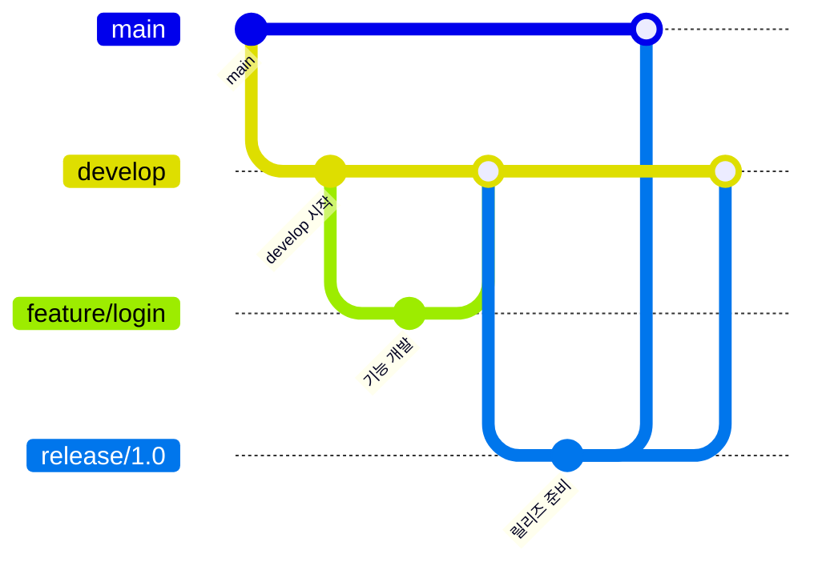
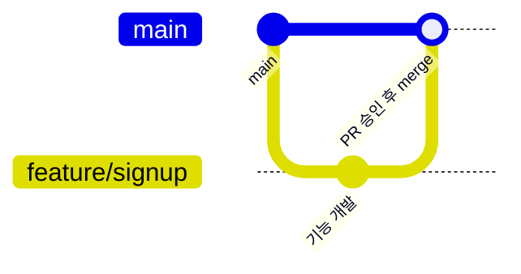
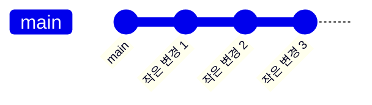

## 들어가며 (Situation)

아직 혼자 공부하는 단계라 실제로 팀과 협업해본 적은 없다. 하지만 곧 여러 사람과 함께 코드를 다룰 일이 생길 걸 대비해서, 미리 브랜치 전략을 알아보기로 했다. 지금까지는 `git branch`, `git checkout`으로 브랜치를 만들고 이동하는 법만 배웠지, "언제 나누고 언제 합쳐야 하는지"에 대한 기준은 없는 상태였다.

## 문제 상황 (Task)

브랜치 명령어를 안다고 해서 브랜치 "전략"을 아는 건 아니었다. 구체적으로 아래 두 가지가 헷갈렸다.

- 브랜치를 언제 새로 만들고, 언제 원래 브랜치로 합쳐야 하는지 기준이 없었다.
- 실제로 팀에서 쓰이는 전략에 어떤 것들이 있는지, 서로 뭐가 다른지 몰랐다.

## 해결 과정 (Action)

가장 널리 언급되는 세 가지 전략 — Git Flow, GitHub Flow, Trunk-Based Development — 을 각 공식/원본 자료를 찾아보며 비교했다.

### 전략 비교

| 전략 | 브랜치 구조 | 병합 빈도 | 잘 맞는 상황 |
|---|---|---|---|
| Git Flow | main + develop + feature/release/hotfix | 상대적으로 낮음 (릴리즈 단위) | 버전을 명시적으로 관리하거나, 여러 버전을 동시에 유지보수해야 하는 프로젝트 |
| GitHub Flow | main + feature | Pull Request 단위로 자주 | 지속적으로 배포하는 단순한 협업 프로젝트 |
| Trunk-Based Development | main(trunk) 중심, 짧은 브랜치 | 하루에도 여러 번 | CI가 잘 갖춰져 있고 빠르게 배포하는 팀·대규모 조직 |

### Git Flow

`develop`을 기준으로 기능 브랜치를 만들고, 릴리즈를 준비할 때 `release` 브랜치로, 급한 버그는 `hotfix` 브랜치로 처리하는 구조다.

### GitHub Flow

`main`에서 바로 기능 브랜치를 만들고, Pull Request 리뷰가 끝나면 바로 `main`에 합친 뒤 브랜치를 지우는 단순한 구조다.

### Trunk-Based Development

브랜치를 거의 만들지 않고, `main`(trunk)에 작은 단위로 자주 커밋하는 방식이다. 팀이 크면 짧게 사는 브랜치를 쓰기도 하지만 곧바로 합친다.

### 헷갈렸던 점

Git Flow의 `develop`과 `main`의 역할 차이를 처음엔 구분하지 못했다. `main`은 "실제로 배포된 상태", `develop`은 "다음 배포를 위해 모으는 중인 상태"라는 걸 정리하고 나서야 왜 브랜치가 이렇게 나뉘는지 이해가 됐다. 또한 세 전략의 병합 빈도 차이가 결국 "CI/CD 환경이 얼마나 갖춰져 있는지"와 연결된다는 것도 비교하면서 알게 됐다.

### 상황별 선택 기준

아직 실제로 적용해본 프로젝트가 없어서 하나로 확정하지는 않았지만, 상황별 기준은 아래처럼 정리했다.

| 상황 | 추천 전략 |
|---|---|
| 여러 버전을 동시에 유지보수해야 함 | Git Flow |
| 빠르게 배포하는 단순한 협업 프로젝트 | GitHub Flow |
| CI/CD가 갖춰진 대규모 팀 | Trunk-Based Development |

## 결과 (Result)

아직 팀 프로젝트를 해본 게 아니라서 정량적인 개선 지표는 없다. 대신 "언제 브랜치를 나누고 합쳐야 하는지" 기준이 전혀 없던 상태에서, 프로젝트 상황(버전 관리 필요 여부, 배포 주기, CI/CD 수준, 팀 규모)에 따라 어떤 전략을 고려해야 하는지 판단 기준을 세울 수 있게 됐다.

## 더 학습하면 좋은 개념

- **Pull Request 리뷰 프로세스** — GitHub Flow에서 merge 전 필수로 거치는 단계다. 협업 시 코드 품질을 지키는 핵심 장치라 반드시 함께 익혀야 한다.
- **CI/CD (지속적 통합/배포)** — Trunk-Based Development가 성립하려면 반드시 필요한 인프라다. 브랜치 전략을 실제로 적용하려면 함께 이해해야 한다.
- **Feature Flag** — 미완성 기능을 배포된 코드에 숨겨두는 기법으로, Trunk-Based Development처럼 짧은 브랜치 전략을 가능하게 하는 핵심 개념이다.
- **Merge vs Rebase** — 브랜치를 합칠 때 히스토리를 어떻게 남길지 결정하는 방법이다. 전략별로 `--no-ff` 같은 옵션을 쓰는 이유를 이해하는 데 필요하다.
- **Semantic Versioning** — Git Flow처럼 버전을 명시적으로 관리하는 전략에서, release 브랜치를 언제 만들지 판단하는 기준이 된다.

## 참고 자료
- [A successful Git branching model (Git Flow 원문)](https://nvie.com/posts/a-successful-git-branching-model/)
- [GitHub 공식 문서 - GitHub flow](https://docs.github.com/en/get-started/using-github/github-flow)
- [trunkbaseddevelopment.com](https://trunkbaseddevelopment.com/)
