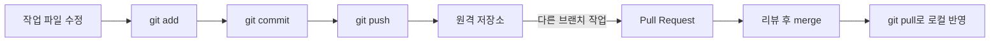
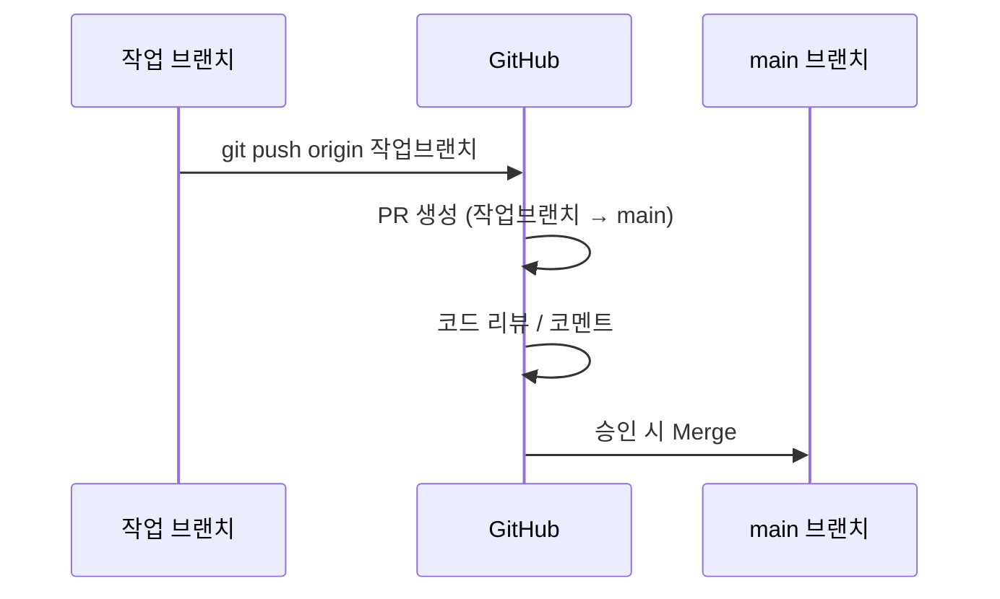

## 들어가며

Git으로 커밋까지는 익숙해졌는데, `push`, `pull`, `pull request(PR)`이 각각 무엇을 하는 명령이고 왜 필요한지 헷갈려서 오늘 정리해봤다.

## 개념 정리

### 전체 흐름



### Push — 로컬 커밋을 원격으로 업로드

```bash
git push origin 브랜치명
```

- 로컬에만 있던 커밋 이력을 GitHub 같은 원격 저장소로 올리는 단계다.
- push를 하기 전까지는 내 컴퓨터에만 존재하는 기록이라, 팀원이나 다른 기기에서는 볼 수 없다.
- 이미 push해서 남과 공유된 커밋을 강제로 되돌리는 작업(`--force`)은 다른 사람의 작업 이력을 깨뜨릴 수 있어 신중해야 한다.

### Pull — 원격의 최신 내용을 로컬로 가져오기

```bash
git pull origin 브랜치명
```

`git pull`은 사실 아래 두 명령을 합친 것이다.

| 명령 | 하는 일 |
|------|---------|
| `git fetch` | 원격 변경사항을 로컬로 받아오기만 함 (merge는 안 함) |
| `git merge` | 받아온 변경사항을 현재 브랜치에 합침 |
| `git pull` | 위 두 개를 한 번에 수행 |

다른 사람이 push한 내용을 내 로컬 브랜치에도 반영하고 싶을 때 사용한다. 로컬에 커밋하지 않은 변경사항이 남아 있으면 충돌이 날 수 있어서, pull 전에 `git status`로 상태를 먼저 확인하는 습관을 들이기로 했다.

### Pull Request (PR) — 병합 요청 + 리뷰



PR은 단순히 push하는 것과 달리, **코드 리뷰와 논의를 거친 뒤 병합**할 수 있게 해주는 GitHub 기능이다. 개인 프로젝트라도 PR을 만들어두면 "이 변경을 왜 했는지"가 기록으로 남아서, 나중에 되짚어보기 좋다는 걸 알게 됐다.

## 한눈에 비교

| 개념 | 범위 | 방향 |
|------|------|------|
| Commit | 로컬 | 작업 파일 → 로컬 저장소 |
| Push | 로컬 → 원격 | 로컬 → GitHub |
| Pull | 원격 → 로컬 | GitHub → 로컬 |
| PR | 원격 브랜치 간 | 작업 브랜치 → main (리뷰 포함) |

## 더 학습하면 좋은 개념

- **Merge conflict (병합 충돌)** — pull이나 PR 병합 중 같은 파일의 같은 부분을 서로 다르게 고쳤을 때 발생한다. 직접 충돌을 해결해봐야 pull/merge의 동작 원리가 명확해진다.
- **Fetch vs Pull 차이** — `git pull`이 편하긴 하지만 자동으로 merge까지 해버려서 예상치 못한 충돌이 생길 수 있다. `git fetch`로 먼저 확인하는 습관을 들이면 더 안전하게 작업할 수 있다.
- **Rebase** — merge 대신 커밋 이력을 한 줄로 정리하는 방법. PR을 깔끔하게 유지하고 싶을 때 알아두면 좋다.
- **브랜치 전략 (Git Flow, GitHub Flow)** — push와 PR을 어떤 브랜치 구조로 운영할지에 대한 규칙. 협업 규모가 커질수록 중요해진다.

## 참고 자료

- [Git 공식 문서 - git-push](https://git-scm.com/docs/git-push)
- [Git 공식 문서 - git-pull](https://git-scm.com/docs/git-pull)
- [Git 공식 문서 - git-fetch](https://git-scm.com/docs/git-fetch)
- [GitHub 공식 문서 - About pull requests](https://docs.github.com/en/pull-requests/collaborating-with-pull-requests/proposing-changes-to-your-work-with-pull-requests/about-pull-requests)
