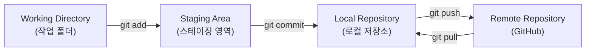
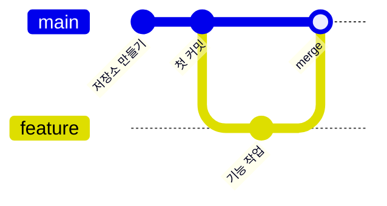
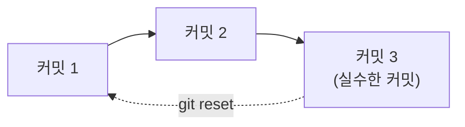

안녕하세요! 이번 주에 Git과 GitHub를 처음 배우고, 직접 블로그까지 만들어서 배포까지 해봤죠?
정말 큰 걸음을 뗀 거예요. 오늘은 이번 주에 배운 개념과 명령어들을 하나씩 정리해볼게요.

## 1. 전체 흐름 한눈에 보기

Git으로 작업할 때 파일이 어떤 순서로 이동하는지 먼저 큰 그림부터 볼까요?

파일을 고치는 것(작업 폴더) → 커밋할 것을 고르는 것(스테이징) → 기록으로 남기는 것(로컬 저장소) → 인터넷에 올리는 것(원격 저장소, GitHub) 순서로 흘러간다고 생각하면 돼요.

## 2. 저장소 만들기

가장 먼저 해야 할 일은 "여기서부터 Git으로 관리할게요"라고 선언하는 것이에요.

|명령어 | 언제 쓰나|
|---|---|
|`git init`| 폴더를 새로운 Git 저장소로 만들고 싶을 때|

이 명령어를 실행하면 그 폴더 안에 눈에 보이지 않는 `.git` 폴더가 생기는데, 여기에 앞으로의 모든 기록이 저장돼요.

## 3. 스테이징 (Staging)

파일을 수정했다고 바로 커밋되는 건 아니에요. 먼저 "이번 커밋에 포함할 파일"을 골라야 하는데, 그 과정이 스테이징이에요.

|명령어 | 언제 쓰나|
|---|---|
|`git add 파일명`| 특정 파일 하나만 스테이징하고 싶을 때|
|`git add .`| 바뀐 파일을 전부 스테이징하고 싶을 때|

**선생님 팁**: 파일을 두 개 고쳤는데 하나만 커밋하고 싶을 때는 `git add`로 원하는 파일만 골라서 담으면 돼요.

## 4. Local Repository (로컬 저장소)

로컬 저장소는 내 컴퓨터 안에 있는, 커밋 기록들이 차곡차곡 쌓이는 공간이에요. 아직 인터넷(GitHub)에는 올라가지 않은 상태죠.

|영역 | 설명|
|---|---|
|Working Directory| 실제로 파일을 열고 수정하는 공간|
|Staging Area| 커밋에 담을 파일을 잠시 모아두는 공간|
|Local Repository| `git commit`으로 만들어진 기록이 저장되는, 내 컴퓨터 안의 저장소|

## 5. 커밋 (Commit)

스테이징한 내용을 하나의 "저장 지점"으로 기록하는 것이 커밋이에요.

|명령어 | 언제 쓰나|
|---|---|
|`git commit -m "메시지"`| 스테이징한 변경 사항을 하나의 기록으로 남기고 싶을 때|

커밋 메시지는 나중에 "이때 무엇을 왜 바꿨는지" 알 수 있게 해주니, 짧더라도 의미 있게 적는 게 좋아요.

## 6. 브랜치 (Branch)

브랜치는 원래 작업(main)에 영향을 주지 않고 따로 실험하거나 새 기능을 만들 수 있는 "갈라진 길"이에요.

|명령어 | 언제 쓰나|
|---|---|
|`git branch 브랜치이름`| 새로운 브랜치를 만들고 싶을 때|
|`git checkout 브랜치이름`| 다른 브랜치로 이동하고 싶을 때|

main 브랜치에서 갈라져 나온 feature 브랜치에서 작업하고, 나중에 다시 main으로 합치는(merge) 흐름이에요.

## 7. push와 pull

내 컴퓨터(로컬 저장소)와 GitHub(원격 저장소)는 자동으로 연결되어 있지 않아요. 직접 주고받아야 해요.

|명령어 | 언제 쓰나|
|---|---|
|`git push`| 내 로컬 저장소의 커밋을 GitHub로 올리고 싶을 때|
|`git pull`| GitHub에 있는 최신 내용을 내 로컬 저장소로 가져오고 싶을 때|

블로그를 배포할 때 썼던 것처럼, `push`를 해야 실제로 인터넷에서 내 변경 사항을 볼 수 있어요.

## 8. merge

merge는 서로 다른 브랜치의 내용을 하나로 합치는 작업이에요. 보통 feature 브랜치에서 작업을 끝낸 뒤, main 브랜치로 합칠 때 사용해요.

|명령어 | 언제 쓰나|
|---|---|
|`git merge 브랜치이름`| 다른 브랜치의 변경 사항을 지금 브랜치로 합치고 싶을 때|

## 9. 되돌리기

작업을 하다 보면 실수로 잘못된 커밋을 만들 때도 있어요. 그럴 때 이전 상태로 되돌릴 수 있어요.

|명령어 | 언제 쓰나|
|---|---|
|`git reset 커밋`| 특정 커밋 시점으로 되돌리고 싶을 때|

**선생님 팁**: `reset`은 기록을 되돌리는 강력한 명령어라서, 사용하기 전에 지금 상태를 한 번 더 확인하는 습관을 들이면 좋아요.

## 정리하며

이번 주에는 저장소 만들기 → 스테이징 → 커밋 → 브랜치 → push/pull → merge → 되돌리기까지, Git의 기본 흐름을 한 바퀴 돌아봤어요. 처음엔 명령어가 많아 보여도, 결국은 "파일이 어디에 있는지"와 "그 파일을 어디로 옮길지"의 문제라는 걸 기억하면 훨씬 쉬워질 거예요. 다음 주에도 화이팅입니다!
