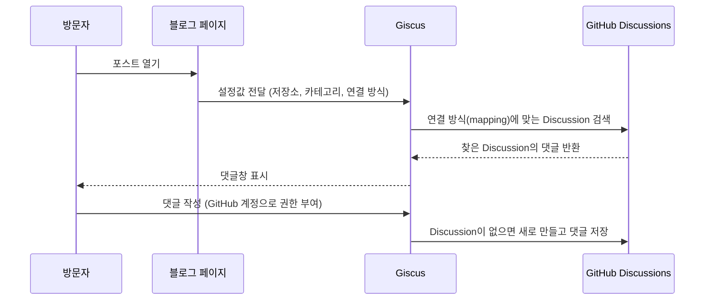

## 들어가며

블로그에 글이 하나씩 쌓이면서 아쉬운 점이 생겼다.

읽는 사람이 글을 보고 끝나는 것이 아니라, 궁금한 점이나 의견을 남길 수 있는 곳이 있으면 좋겠다는 생각이었다.

그런데 이 블로그는 GitHub Pages로 배포하는 **정적 사이트**다. 서버도 없고 데이터베이스도 없다.

커뮤니티 서비스처럼 댓글을 직접 저장하려면 서버와 DB, 로그인까지 만들어야 해서 일이 꽤 커진다.

그러다 GitHub 기반 개발 블로그에서 많이 쓰는 **Giscus**라는 댓글 시스템을 알게 됐다.

이 글은 Giscus가 어떤 구조로 동작하는지, GitHub 저장소 쪽에서 무엇을 준비해야 하는지 공부한 내용을 정리한 노트다. 설명은 giscus 공식 사이트와 README, GitHub Docs를 기준으로 확인했다.

---

## 정적 사이트에서 댓글이 어려운 이유

먼저 왜 GitHub Pages 블로그에 댓글을 붙이기가 어려운지부터 정리했다.

댓글 기능에는 보통 이런 것들이 필요하다.

| 댓글에 필요한 것 | GitHub Pages 블로그의 상황 |
|------|------|
| 댓글을 저장할 곳 | DB가 없다 |
| 누가 썼는지 확인 | 로그인·인증 서버가 없다 |
| 새 댓글을 바로 보여주기 | 사이트는 미리 빌드된 파일이라 스스로 바뀌지 않는다 |

즉 정적 사이트는 **이미 만들어진 파일을 보여주는 것**은 잘하지만, 방문자가 보낸 데이터를 받아서 저장하는 일은 할 수 없다.

그래서 정적 사이트에서 댓글을 쓰려면 저장과 로그인을 **외부 서비스에 맡기는 방식**을 쓰게 된다. Giscus는 그 외부 저장소로 GitHub를 사용한다.

---

## Giscus란?

Giscus는 **GitHub Discussions를 이용하는 댓글 시스템**이다.

별도의 댓글 데이터베이스를 만드는 대신 댓글을 GitHub 저장소의 Discussions에 저장한다.

블로그의 특정 글과 GitHub Discussion 하나를 연결해 두고, 블로그 화면에서는 그 Discussion을 일반적인 댓글창처럼 보여주는 구조다.

```text
블로그 포스트
   ↓
Giscus
   ↓
GitHub Discussions
   ↓
댓글 / 답글 / 반응 저장
```

역할을 나눠 보면 이렇다.

| 구성 요소 | 하는 일 |
|------|------|
| 블로그 페이지 | 댓글창이 들어갈 자리와 Giscus 스크립트를 가진다 |
| Giscus | 연결할 Discussion을 찾고, 댓글창을 iframe으로 그려 준다 |
| GitHub Discussions | 댓글·답글·반응을 실제로 저장한다 |

블로그 쪽 코드는 스크립트 한 줄을 넣는 정도라서, GitHub를 이미 쓰고 있는 개발 블로그라면 **댓글 서버를 따로 운영하지 않아도 된다.**

### GitHub Discussions는 무엇인가

Giscus를 이해하려면 Discussions도 알아야 했다.

GitHub Docs에서는 Discussions를 프로젝트 주변 커뮤니티를 위한 **협업 소통 공간(forum)**으로 설명한다.

Issue가 할 일이나 버그를 추적하는 곳이라면, Discussion은 질문이나 의견을 주고받는 곳에 가깝다.

Discussion은 카테고리로 나뉘고, 카테고리마다 형식이 있다. 그중 **Announcements** 형식은 저장소에 maintain 이상의 권한이 있는 사람만 새 Discussion을 만들 수 있고, 댓글과 답글은 누구나 달 수 있다.

giscus 공식 사이트도 Announcements 형식의 카테고리를 쓰라고 권장한다. 그래야 새 Discussion은 저장소 관리자와 giscus만 만들 수 있기 때문이다.

---

## Giscus는 어떤 순서로 동작할까

공식 README의 설명을 순서대로 그려 보면 다음과 같다.



핵심은 두 가지였다.

- 페이지가 열릴 때 **GitHub Discussions 검색 API**로 이 페이지에 연결된 Discussion을 찾는다.
- 찾는 Discussion이 없으면, 누군가 **처음 댓글이나 반응을 남길 때** giscus 봇이 Discussion을 자동으로 만든다.

그래서 글을 새로 올릴 때마다 Discussion을 미리 만들어 둘 필요가 없다.

---

## 글마다 댓글은 어떻게 구분할까?

처음에는 모든 글의 댓글이 Discussion 하나에 섞이지 않을까 싶었다.

Giscus는 **어떤 기준으로 페이지와 Discussion을 연결할지(mapping)**를 고를 수 있다.

| mapping | 찾는 기준 | 자동 생성 |
|------|------|------|
| `pathname` | 제목에 페이지 URL의 경로 부분이 들어간 Discussion | 가능 |
| `url` | 제목에 페이지 전체 URL이 들어간 Discussion | 가능 |
| `title` | 제목에 페이지의 `<title>`이 들어간 Discussion | 가능 |
| `og:title` | 제목에 페이지의 `og:title` 값이 들어간 Discussion | 가능 |
| `specific` | 제목에 내가 정한 특정 문자열이 들어간 Discussion | 가능 |
| `number` | 번호로 지정한 Discussion 하나 | **불가** |

`number`만 자동 생성을 지원하지 않는다. 이미 있는 Discussion을 번호로 불러오는 방식이기 때문이다.

### strict 옵션

기본 검색은 GitHub의 **유사 검색(fuzzy search)**을 쓴다.

그래서 제목이 비슷한 Discussion이 여러 개 있으면 엉뚱한 Discussion이 연결될 수도 있다.

`strict` 옵션을 켜면 이런 잘못된 연결을 막을 수 있다. 글이 많아질수록 켜 두는 편이 안전해 보였다.

### 어떤 기준이 관리하기 편할까

개발 블로그는 글 제목을 나중에 고칠 수도 있다.

`title`이나 `og:title` 기준이면 제목을 바꾸는 순간 기존 Discussion과 연결이 끊길 수 있다.

그래서 처음에는 URL 경로인 `pathname` 기준이 가장 관리하기 편해 보였다.

그런데 이 블로그의 구조를 떠올려 보니 한 가지 조건이 더 있었다.

이 블로그의 글 주소에는 카테고리가 들어간다.

```text
/my-blog/git/2026/09/24/글-이름.html
```

그러면 `pathname` 기준이라도 **카테고리를 바꾸거나 파일 이름을 바꾸면 주소가 바뀌고, 댓글 연결도 같이 끊긴다.**

결국 어떤 mapping을 고르든

> 이 기준값이 나중에 바뀔 수 있는가?

를 먼저 생각해야 했다.

| mapping | 연결이 끊기는 경우 |
|------|------|
| `pathname` | 주소(카테고리, 파일 이름)가 바뀔 때 |
| `url` | 주소가 바뀌거나 도메인이 바뀔 때 |
| `title` / `og:title` | 글 제목을 고칠 때 |
| `specific` | 정해 둔 문자열을 바꿀 때 |

---

## 이 블로그의 방명록은 specific을 쓰고 있다

이 블로그의 방명록 페이지에는 이미 Giscus가 붙어 있고, 연결 방식은 `specific`이다.

방명록 설정 중 연결 방식과 화면 옵션 부분만 옮기면 다음과 같다.

```html
<script src="https://giscus.app/client.js"
        data-mapping="specific"
        data-term="Guestbook"
        data-strict="1"
        data-reactions-enabled="1"
        data-input-position="top"
        data-theme="light"
        data-lang="ko"
        data-loading="lazy"
        crossorigin="anonymous"
        async>
</script>
```

방명록은 어느 페이지에서 쓰든 **모든 글이 Discussion 하나에 모여야** 한다.

그래서 페이지 주소와 상관없이 `Guestbook`이라는 고정 문자열로 찾고, `strict`로 비슷한 제목의 다른 Discussion과 섞이지 않게 해 둔 것이다.

반대로 포스트마다 댓글을 따로 받으려면 글마다 다른 Discussion이 필요하니 `specific`이 아니라 `pathname` 같은 기준을 써야 한다.

같은 Giscus라도 **mapping 하나로 방명록이 되기도 하고 글별 댓글이 되기도 한다.**

방명록을 붙이게 된 과정은 [방문자 코멘트 기능 고민하기]({{ site.baseurl }})에 따로 정리해 두었다.

---

## 적용하려면 무엇이 필요할까?

Giscus를 쓰려면 GitHub 저장소 쪽에서 세 가지 조건을 맞춰야 한다.

| 조건 | 필요한 이유 |
|------|------|
| 저장소가 **공개(public)** 상태 | 비공개면 방문자가 Discussion을 볼 수 없다 |
| 저장소에 **giscus 앱 설치** | 설치하지 않으면 방문자가 댓글과 반응을 남길 수 없다 |
| 저장소에서 **Discussions 활성화** | 댓글이 저장될 공간 자체가 없다 |

이 세 가지를 맞춘 뒤 giscus 사이트에서 저장소, Discussion 카테고리, mapping 등을 고르면 블로그에 넣을 스크립트가 만들어진다.

```text
저장소 공개 확인
→ Settings에서 Discussions 활성화
→ giscus 앱 설치
→ giscus 사이트에서 저장소·카테고리·mapping 선택
→ 생성된 스크립트를 레이아웃이나 페이지에 삽입
```

블로그 안에 백엔드 코드를 새로 만드는 일은 없다.

설정의 대부분이 **GitHub 저장소 설정**이라서 이 글을 Git & GitHub 카테고리에 정리했다.

---

## 디자인은 어디까지 바꿀 수 있을까?

처음에는 GitHub 댓글창이 그대로 붙는 정도라고 생각했는데, 스크립트의 `data-` 속성으로 바꿀 수 있는 것이 꽤 많았다.

| 설정 | 속성 | 내용 |
|------|------|------|
| 테마 | `data-theme` | 밝은 테마, 어두운 테마, 시스템 테마 따라가기, 직접 만든 CSS 주소 |
| 언어 | `data-lang` | 댓글창에 표시되는 언어 |
| 입력창 위치 | `data-input-position` | `top`이면 댓글 목록 위에 입력창을 둔다 |
| 반응 | `data-reactions-enabled` | 글에 대한 반응(이모지) 표시 여부 |
| 지연 로딩 | `data-loading="lazy"` | 댓글 영역 근처까지 스크롤했을 때 불러온다 |

여기서 헷갈리기 쉬운 부분이 있었다.

댓글창은 **iframe 안에서 그려진다.** 그래서 내 블로그 CSS로 댓글창 안쪽 글자나 버튼을 직접 바꿀 수는 없다.

- 댓글창 **안쪽 모양** → `data-theme`로 바꾼다.
- 댓글창을 감싸는 **바깥 레이아웃** → 블로그 페이지에서 `.giscus`, `.giscus-frame` 선택자로 조절한다.

만약 포스트마다 댓글을 붙인다면 댓글 기능을 강조하기보다, 글을 다 읽은 뒤 자연스럽게 의견을 남기는 정도의 단순한 구성이 이 블로그에 맞을 것 같다.

```text
본문

────────────

이 글이 도움이 되었나요?
의견이나 질문을 남겨주세요.

[Giscus 댓글 영역]
```

---

## Giscus의 한계

Giscus가 모든 블로그에 완벽한 댓글 시스템은 아니었다.

- **GitHub 계정이 필요하다.** 댓글을 쓰려면 방문자가 GitHub OAuth로 giscus 앱에 권한을 주거나, GitHub의 Discussion 페이지에서 직접 댓글을 달아야 한다.
- **저장소가 공개되어 있어야 한다.** 댓글도 GitHub Discussions에 그대로 공개된다.
- **외부 서비스에 기대는 구조다.** README에도 giscus와 GitHub Discussions API가 계속 개발 중이라 일부 기능이 바뀌거나 동작하지 않을 수 있다고 적혀 있다.

일반 방문자를 대상으로 하는 블로그라면 GitHub 계정이 진입장벽이 될 수 있다.

하지만 개발 블로그는 방문자도 GitHub 계정을 가지고 있을 가능성이 비교적 높아서 잘 맞는 편이라고 생각한다.

---

## 정리

공부하기 전과 후에 생각이 이렇게 바뀌었다.

| 처음 생각 | 공부한 뒤 |
|------|------|
| 댓글을 넣으려면 서버와 DB가 필요하다 | 저장은 GitHub Discussions, 로그인은 GitHub 계정에 맡길 수 있다 |
| 모든 글의 댓글이 한곳에 섞일 것 같다 | mapping으로 글마다 다른 Discussion에 연결한다 |
| 글 제목은 바뀔 수 있으니 `pathname`이 편해 보인다 | `pathname`도 주소가 바뀌면 끊기니, 기준값이 바뀌는지부터 봐야 한다 |
| GitHub 댓글창이 그대로 붙는 정도일 것 같다 | 테마·언어·입력창 위치를 고를 수 있고, 바깥 레이아웃은 CSS로 조절한다 |

```text
GitHub Pages
+
GitHub Discussions
+
Giscus
```

이 조합이면 지금 쓰고 있는 GitHub 환경을 크게 벗어나지 않고 댓글 기능을 붙일 수 있다.

이 블로그에서는 방명록에만 이 조합을 쓰고 있고, 포스트마다 댓글을 받는 기능은 아직 붙이지 않았다.

나중에 글별 댓글이 필요해지면 `pathname`과 `strict`를 먼저 검토하고, 그 전에 글 주소를 쉽게 바꾸지 않는 규칙부터 지키려고 한다.

---

## 더 학습하면 좋은 개념

- **GitHub Discussions 카테고리 형식** — Announcements, Q&A 같은 형식에 따라 누가 Discussion을 만들 수 있는지가 달라진다. giscus가 Announcements 형식을 권장하는 이유를 이해할 수 있다.
- **OAuth 2.0** — 방문자가 giscus 앱에 "내 대신 댓글을 써도 된다"고 권한을 주는 흐름의 바탕이 되는 방식이다.
- **GitHub GraphQL API** — Discussions는 GraphQL API로 다룬다. giscus가 Discussion을 검색하고 만드는 방식을 더 깊게 이해할 수 있다.
- **iframe과 postMessage** — 댓글창이 블로그 페이지와 분리되어 그려지는 이유, 그리고 페이지에서 테마 같은 설정을 바꿔 보내는 방법과 연결된다.
- **utterances** — GitHub Issues를 저장소로 쓰는 비슷한 댓글 시스템이다. Issues와 Discussions의 차이를 비교해 보기 좋다.

## 참고 자료

- [giscus 공식 사이트](https://giscus.app/ko)
- [giscus GitHub 저장소 README](https://github.com/giscus/giscus)
- [giscus 고급 사용법 (ADVANCED-USAGE)](https://github.com/giscus/giscus/blob/main/ADVANCED-USAGE.md)
- [GitHub Docs - About discussions](https://docs.github.com/en/discussions/collaborating-with-your-community-using-discussions/about-discussions)
- [GitHub Docs - Managing categories for discussions](https://docs.github.com/en/discussions/managing-discussions-for-your-community/managing-categories-for-discussions)
- [GitHub Docs - Enabling or disabling GitHub Discussions for a repository](https://docs.github.com/en/repositories/managing-your-repositorys-settings-and-features/enabling-features-for-your-repository/enabling-or-disabling-github-discussions-for-a-repository)
