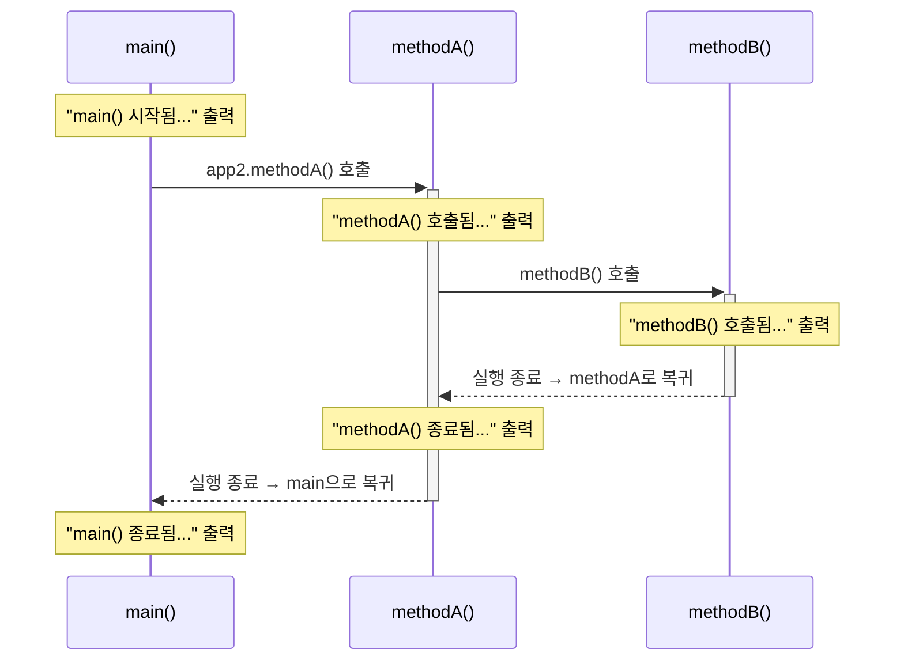

앞에서는 조건문으로 실행할 코드를 선택하고, 반복문으로 같은 코드를 여러 번 실행하는 방법을 배웠다.

그런데 프로그램이 커지면 또 다른 문제가 생긴다.

같은 작업이 여러 곳에서 필요할 때마다 코드를 반복해서 작성해야 한다는 것이다.

예를 들어 두 수를 더하는 작업을 여러 번 수행한다고 생각해 보자.

```java
int num1 = 1;
int num2 = 2;
System.out.println("1번째 연산 결과 : " + (num1 + num2));

int num3 = 3;
int num4 = 4;
System.out.println("2번째 연산 결과 : " + (num3 + num4));
```

계산 방법은 똑같은데 숫자가 달라질 때마다 변수와 연산 코드를 다시 작성하고 있다.

이런 반복적인 작업을 하나의 코드로 정리하고 필요할 때 사용할 수 있도록 만드는 것이 **메서드(Method)**이다.

이번 수업에서는 메서드를 직접 선언하고 호출하면서 **매개변수, 반환값, `return` 그리고 메서드가 호출되는 실행 흐름**을 살펴보았다.

---

## 메서드란?

메서드는 **특정 작업을 수행하는 코드 블록**이다.

반복해서 사용하는 작업을 메서드로 만들면 같은 코드를 여러 번 작성하지 않고 필요할 때 호출해서 사용할 수 있다.

메서드를 사용하는 이유는 크게 다음과 같이 정리할 수 있다.

- 반복되는 코드를 줄일 수 있다.
- 코드의 역할을 구분하기 쉬워진다.
- 코드의 재사용성이 높아진다.
- 수정해야 할 부분을 한곳에서 관리하기 쉬워진다.
- 프로그램의 구조를 파악하기 쉬워진다.

예를 들어 두 숫자를 더하는 규칙을 메서드 하나로 만들었다면, 계산할 숫자가 달라져도 같은 메서드를 다시 사용할 수 있다.

---

## 메서드의 기본 형태

메서드는 기본적으로 다음과 같은 형태로 선언한다.

```java
[접근제어자] [반환타입] 메서드명([매개변수]) {
    실행할 코드

    [return 반환값;]
}
```

예를 들어 두 정수를 받아 더한 결과를 돌려주는 메서드는 다음과 같다.

```java
public int sumTwoNumber(int a, int b) {
    return a + b;
}
```

각 부분을 나누어 보면 다음과 같다.

| 구성 | 예제 | 역할 |
|---|---|---|
| 접근제어자 | `public` | 메서드에 접근할 수 있는 범위를 지정 |
| 반환 타입 | `int` | 메서드가 돌려주는 값의 타입 |
| 메서드명 | `sumTwoNumber` | 메서드를 구분하는 이름 |
| 매개변수 | `int a, int b` | 호출할 때 전달받을 값 |
| `return` | `return a + b;` | 계산 결과를 호출한 곳으로 반환 |

이번 수업에서는 이 구조를 모두 깊게 파고들기보다 **메서드가 값을 받아 작업하고 결과를 돌려주는 과정**을 먼저 확인했다.

---

## 메서드를 호출하기

메서드는 작성했다고 자동으로 실행되는 것이 아니다.

필요한 위치에서 **호출**해야 한다.

이번 예제에서는 `Application01` 객체를 생성한 뒤 메서드를 호출했다.

```java
Application01 app = new Application01();
```

그리고 `.`을 이용해 객체가 가지고 있는 메서드에 접근한다.

```java
app.sumTwoNumber(5, 6);
```

여기서 `.`은 **참조 연산자**이다.

이번 수업의 흐름에서는 다음과 같이 이해할 수 있다.

```text
app
 ↓
Application01 객체를 참조
 ↓
.
 ↓
객체 내부의 메서드에 접근
 ↓
sumTwoNumber()
```

그리고 메서드 이름 뒤의 `()`는 메서드를 **호출**한다는 의미가 있다.

```java
app.sumTwoNumber(5, 6);
```

즉, `sumTwoNumber`라는 메서드를 찾아 실제로 실행한다.

---

## 매개변수로 값 전달하기

다음 메서드를 다시 살펴보자.

```java
public int sumTwoNumber(int a, int b) {
    return a + b;
}
```

`a`와 `b`는 **매개변수(parameter)**이다.

메서드가 작업에 필요한 값을 외부에서 전달받을 수 있도록 만든 변수이다.

다음과 같이 호출하면,

```java
app.sumTwoNumber(5, 6);
```

호출할 때 전달한 값이 메서드의 매개변수로 들어간다.

```text
sumTwoNumber(5, 6)
              │  │
              ▼  ▼
              a  b
              │  │
              5  6
```

따라서 메서드 내부에서는 다음 계산이 이루어진다.

```java
return a + b;
```

현재 `a`는 `5`, `b`는 `6`이므로 결과는 `11`이다.

매개변수를 사용하면 같은 메서드에 다른 값을 전달해 계속 재사용할 수 있다.

```java
app.sumTwoNumber(5, 6);
app.sumTwoNumber(7, 8);
app.sumTwoNumber(9, 10);
```

메서드의 규칙은 하나이지만 전달하는 값에 따라 결과가 달라진다.

---

## 반환값과 return

메서드에서 계산한 값을 호출한 곳으로 돌려주고 싶다면 `return`을 사용할 수 있다.

```java
public int sumTwoNumber(int a, int b) {
    return a + b;
}
```

여기서 반환 타입은 `int`이다.

```text
public int sumTwoNumber(...)
       ↑
   반환 타입
```

따라서 이 메서드는 실행을 마친 뒤 **정수 값을 반환한다.**

호출부터 반환까지의 흐름을 보면 다음과 같다.

```text
main()

app.sumTwoNumber(5, 6)
          │
          │ 호출
          ▼
┌─────────────────────────┐
│ sumTwoNumber(int a,     │
│              int b)     │
│                         │
│ a = 5                   │
│ b = 6                   │
│                         │
│ return a + b;           │
│        ↓                │
│        11               │
└──────────┬──────────────┘
           │
           │ 반환
           ▼
main()

결과: 11
```

중요한 것은 메서드를 호출하면 실행 흐름이 메서드로 이동하고, 메서드의 작업이 끝나면 **호출이 시작된 곳으로 돌아온다는 것**이다.

---

## 반환 타입은 반환값과 맞아야 한다

메서드가 값을 반환한다면 어떤 종류의 값을 반환하는지도 명시해야 한다.

```java
public int sumTwoNumber(int a, int b) {
    return a + b;
}
```

`a + b`의 결과는 정수이므로 반환 타입을 `int`로 선언했다.

즉,

```text
반환 타입
   ↓
  int sumTwoNumber(...)
         ↓
     return a + b;
         ↓
       정수 반환
```

처럼 반환 타입과 실제 반환값이 맞아야 한다.

메서드를 볼 때는 단순히 `return`만 확인하는 것이 아니라,

> **이 메서드는 어떤 타입의 결과를 돌려주는가?**

를 함께 확인해야 한다.

---

## 반환된 값 사용하기

반환된 값은 다른 코드에서 사용할 수 있다.

수업에서 작성한 예제는 다음과 같은 형태였다.

```java
System.out.println("3번째 연산: " + app.sumTwoNumber(5, 6));
System.out.println("4번째 연산: " + app.sumTwoNumber(7, 8));
System.out.println("5번째 연산: " + app.sumTwoNumber(9, 10));
```

첫 번째 코드를 실행 흐름으로 풀어 보면 다음과 같다.

```text
System.out.println(
    "3번째 연산: " + app.sumTwoNumber(5, 6)
)
                         │
                         ▼
                 sumTwoNumber 호출
                         │
                      5 + 6
                         │
                         ▼
                     return 11
                         │
                         ▼
System.out.println(
    "3번째 연산: " + 11
)
                         │
                         ▼
               3번째 연산: 11
```

메서드를 호출한 부분에 반환된 결과가 들어와 다음 연산에 사용되는 것이다.

---

## void는 무엇일까

모든 메서드가 값을 반환해야 하는 것은 아니다.

반환할 값이 없는 메서드에서는 반환 타입 자리에 `void`를 사용한다.

```java
public void methodA() {
    System.out.println("methodA() 호출됨...");
}
```

`methodA()`의 목적은 문자열을 출력하는 것이다.

호출한 곳에 정수나 문자열 같은 결과값을 돌려줄 필요가 없다.

따라서 반환 타입을 다음과 같이 작성한다.

```text
public void methodA()
       ↑
반환값 없음
```

반면 앞에서 만든 메서드는 계산 결과를 반환해야 했다.

```java
public int sumTwoNumber(int a, int b) {
    return a + b;
}
```

두 메서드를 비교하면 차이가 명확하다.

| 메서드 | 반환 타입 | 반환값 |
|---|---|---|
| `methodA()` | `void` | 없음 |
| `sumTwoNumber()` | `int` | 정수 |

---

## 메서드는 작성만 해서는 실행되지 않는다

수업에서 `methodA()`와 `methodB()`를 이용해 메서드의 호출 흐름도 확인했다.

먼저 `main()`에서 `methodA()`를 호출한다.

```java
public static void main(String[] args) {

    System.out.println("main() 시작됨...");

    Application02 app2 = new Application02();

    app2.methodA();

    System.out.println("main() 종료됨...");
}
```

그리고 `main()` 밖에 `methodA()`를 작성한다.

```java
public void methodA() {
    System.out.println("methodA() 호출됨...");
}
```

프로그램이 실행되면 `main()`에서 `methodA()`를 호출했기 때문에 해당 메서드의 코드가 실행된다.

그렇다면 `methodB()`도 작성하기만 하면 실행될까?

```java
public void methodB() {
    System.out.println("methodB() 호출됨...");
}
```

그렇지 않다.

메서드는 **정의되어 있다는 이유만으로 실행되지 않는다.**

누군가 해당 메서드를 호출해야 한다.

수업에서 정리한 표현 그대로 생각하면 이해하기 쉽다.

> 부르지 않았는데 실행될 수는 없다.

---

## 메서드 안에서 다른 메서드 호출하기

`methodB()`를 실행하기 위해 `methodA()` 안에서 호출할 수도 있다.

```java
public void methodA() {

    System.out.println("methodA() 호출됨...");

    methodB();

    System.out.println("methodA() 종료됨...");
}
```

그리고 `methodB()`는 다음과 같다.

```java
public void methodB() {
    System.out.println("methodB() 호출됨...");
}
```

이제 실행 흐름이 조금 더 복잡해진다.

`main()`이 `methodA()`를 호출하고, 실행 중인 `methodA()`가 다시 `methodB()`를 호출한다.

---

## main → methodA → methodB의 실행 흐름

전체 코드를 간단히 보면 다음과 같다.

```java
public class Application02 {

    public static void main(String[] args) {

        System.out.println("main() 시작됨...");

        Application02 app2 = new Application02();
        app2.methodA();

        System.out.println("main() 종료됨...");
    }

    public void methodA() {

        System.out.println("methodA() 호출됨...");

        methodB();

        System.out.println("methodA() 종료됨...");
    }

    public void methodB() {
        System.out.println("methodB() 호출됨...");
    }
}
```

코드를 위에서 아래로 읽기만 하면 실제 실행 순서를 놓치기 쉽다.

실제 흐름은 다음과 같다.



결국 실행 순서는 다음과 같다.

```text
main 시작
   ↓
methodA 호출
   ↓
methodA 실행
   ↓
methodB 호출
   ↓
methodB 실행
   ↓
methodB 종료
   ↓
methodA로 돌아옴
   ↓
methodA 나머지 코드 실행
   ↓
methodA 종료
   ↓
main으로 돌아옴
   ↓
main 나머지 코드 실행
   ↓
main 종료
```

출력 결과도 이 순서를 그대로 따른다.

```text
main() 시작됨...
methodA() 호출됨...
methodB() 호출됨...
methodA() 종료됨...
main() 종료됨...
```

---

## 호출이 끝나면 어디로 돌아갈까

이번 수업에서 메서드를 이해할 때 가장 중요했던 부분이다.

메서드를 호출하면 실행 흐름이 그 메서드로 이동했다가, 작업이 끝나면 **자신을 호출한 지점으로 돌아간다.**

```text
main
 │
 │ methodA 호출
 ▼
methodA
 │
 │ methodB 호출
 ▼
methodB
 │
 │ 종료
 ▼
methodA
 │
 │ 종료
 ▼
main
```

즉,

```text
main → methodA → methodB
```

로 이동한 뒤 끝나는 것이 아니다.

호출한 곳으로 돌아오는 과정까지 포함하면 다음과 같다.

```text
main → methodA → methodB → methodA → main
```

메서드 호출이 여러 단계로 이어질수록 **현재 어느 메서드를 실행하고 있고, 작업이 끝난 뒤 어디로 돌아가는지**를 따라가는 것이 중요하다.

---

## 코드의 위치와 실행 순서는 다를 수 있다

메서드가 `main()` 아래쪽에 작성되어 있다고 해서 프로그램이 단순히 파일의 위에서 아래까지 모든 메서드를 차례대로 실행하는 것은 아니다.

```java
public static void main(String[] args) {
    System.out.println("main");

    Application02 app = new Application02();
    app.methodA();
}

public void methodA() {
    System.out.println("A");
}

public void methodB() {
    System.out.println("B");
}
```

`methodB()`가 코드에 존재해도 호출하지 않았기 때문에 실행되지 않는다.

따라서 메서드가 포함된 프로그램을 읽을 때는 **코드가 작성된 위치만 보는 것이 아니라 호출 관계를 따라가야 한다.**

```text
어떤 메서드가 호출되는가?
        ↓
그 메서드 안에서 무엇을 실행하는가?
        ↓
다른 메서드를 다시 호출하는가?
        ↓
종료 후 어디로 돌아가는가?
```

이 흐름을 따라가면 메서드가 많아져도 프로그램의 실행 순서를 파악하기 쉬워진다.

---

## 메서드를 사용하기 전과 후

처음 작성했던 두 수의 덧셈 코드는 계산할 때마다 비슷한 코드가 반복되었다.

```java
int num1 = 1;
int num2 = 2;
System.out.println(num1 + num2);

int num3 = 3;
int num4 = 4;
System.out.println(num3 + num4);
```

메서드를 만들면 덧셈이라는 규칙을 한곳에 둘 수 있다.

```java
public int sumTwoNumber(int a, int b) {
    return a + b;
}
```

그리고 필요한 값만 전달한다.

```java
app.sumTwoNumber(1, 2);
app.sumTwoNumber(3, 4);
app.sumTwoNumber(5, 6);
```

정리하면 다음과 같다.

```text
메서드 사용 전

값 준비 → 덧셈
값 준비 → 덧셈
값 준비 → 덧셈


메서드 사용 후

       ┌→ (1, 2)
덧셈 규칙 ─→ (3, 4)
       └→ (5, 6)
```

같은 작업을 반복해서 작성하는 대신 **작업의 규칙은 메서드로 만들고 필요한 값만 바꾸어 전달하는 구조**가 된다.

---

## 정리

메서드는 특정 작업을 수행하는 코드 블록이다.

이번 수업에서는 메서드를 단순히 선언하는 문법보다 **값이 들어오고, 메서드가 실행되고, 결과가 다시 돌아가는 흐름**을 확인했다.

매개변수는 메서드가 작업에 필요한 값을 전달받는 통로이다.

```text
호출
sumTwoNumber(5, 6)
        ↓
매개변수
a = 5, b = 6
        ↓
메서드 실행
a + b
        ↓
return
11
        ↓
호출한 곳으로 반환
```

반환할 값이 있다면 반환 타입을 지정하고 `return`을 사용한다.

```java
public int sumTwoNumber(int a, int b) {
    return a + b;
}
```

반환할 값이 없다면 `void`를 사용할 수 있다.

```java
public void methodA() {
    System.out.println("methodA() 호출됨...");
}
```

그리고 메서드는 작성했다고 자동으로 실행되지 않는다. **호출되어야 실행된다.**

특히 여러 메서드가 서로를 호출할 때는 다음 흐름을 기억해야 한다.

```text
main
 ↓
methodA
 ↓
methodB
 ↓
methodA
 ↓
main
```

메서드를 호출하면 잠시 다른 코드로 이동하지만, 작업이 끝나면 **호출한 곳으로 돌아와 다음 코드를 계속 실행한다.**

이번 단계에서는 메서드의 문법을 외우는 것보다,

> **호출 → 값 전달 → 실행 → 반환 → 호출한 곳으로 복귀**

라는 흐름을 이해하는 것이 핵심이다.
